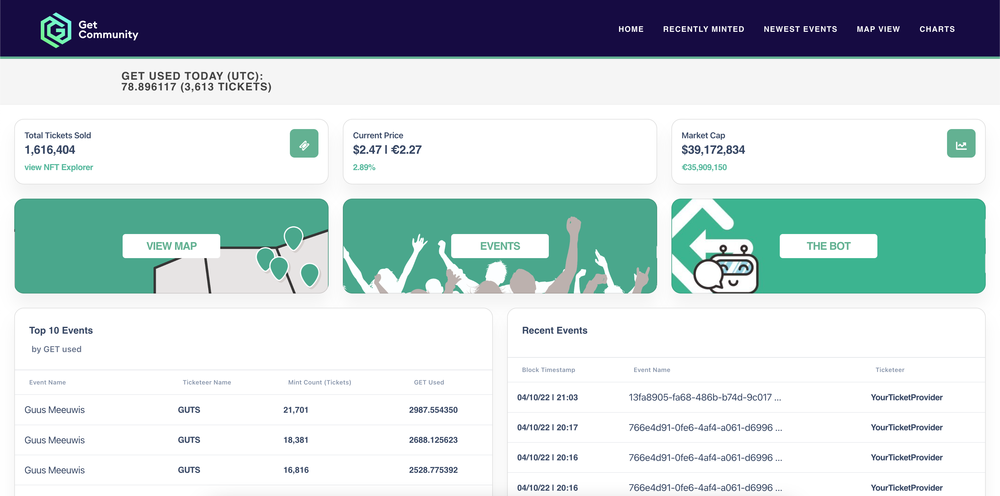

<div id="top"></div>
<!-- PROJECT LOGO -->
<br />
<div align="center">
<h3 align="center">GET_community_dashboard</h3>

  <p align="center">
    A dashboard to illustrate the flow of the GET token, through events, ticketeers and time.
    <br />
    <a href="https://github.com/simonbromfield/GET_community_dashboard"><strong>Explore the docs »</strong></a>
    <br />
    <br />
    <a href="https://dashboard.get-community.com">View Dashboard</a>
  </p>
</div>


<!-- ABOUT THE PROJECT -->
## About The Project

[](https://dashboard.get-community.com)

<p align="right">(<a href="#top">back to top</a>)</p>


### Built With

* [NodeJS](https://nodejs.org)
* [Express](https://expressjs.com/)
* [Bootstrap](https://getbootstrap.com)
* [JQuery](https://jquery.com)

<p align="right">(<a href="#top">back to top</a>)</p>


<!-- GETTING STARTED -->
## Getting Started

To get a local copy up and running follow these simple example steps.

### Prerequisites

You'll need to have certain software & frameworks downloaded. Follow these steps to GET it done:
* Download the latest version of [NodeJS](https://nodejs.org/en/download/current/), or at least 16.4.0.
* Open Windows Powershell, your own favourite commandline tool or the Mac equivalent.
* Perform the following command to update npm and its packages: ```npm install npm@latest -g```
* Perform the following commands to install Express, Bootstrap & JQuery:
  * ```npm install express --save```
  * ```npm install bootstrap```
  * ```npm install jquery```

### Windows specific
On Windows, you might need to follow [these steps](https://github.com/nodejs/node-gyp#on-windows) to download node-gyp, Python & some VS packages.
Here's what worked for me (Jeronemo):
* Install node-gyp: ```npm install -g node-gyp```
* Download Python 3.10 [via Microsoft Store](https://www.microsoft.com/en-us/p/python-310/9pjpw5ldxlz5).
* Download [Visual Studio packages](https://visualstudio.microsoft.com/thank-you-downloading-visual-studio/?sku=BuildTools) as described in the github nodejs link.
* Set the MicroSoft Visual Studio version to 2019: ```npm config set msvs_version 2019```.
  * Do note that this is different from the 2017 mentioned in the article, but during debugging I found this one to be available and not 2017.

### Installation

1. If you don't have a github account yet, [sign up](https://github.com/signup) first.
2. Go to the folder you want the github dashboard (and possible future) projects in, i.e. ```cd C:/Work/Prive```
3. Clone the Dashboard using the following command:
   ```sh
   git clone https://github.com/simonbromfield/GET-Community-Dashboard.git
   ```
4. Go into the project: ```cd GET-Community-Dashboard```, or full path ```cd C:/Work/Prive/GET-Community-Dashboard```
5. The project has a ```package-lock.json``` file containing all necessary dependencies. Download them using ```npm install```. 
   * If this doesn't succeed, you'll have to go on a debugging spree. Start by reading the error message carefully and checking out the specific settings above for hints.
6. You can now start running the project locally using the command ```npm start```
7. If successful, you can now visit the dashboard in your browser by going to http://localhost:3000/.

<p align="right">(<a href="#top">back to top</a>)</p>


<!-- CONTRIBUTING -->
## Contributing

Contributions are what make the open source community such an amazing place to learn, inspire, and create. Any contributions you make are **greatly appreciated**.

If you have a suggestion that would make this better, please fork the repo and create a pull request. You can also simply open an issue with the tag "enhancement".
Don't forget to give the project a star! Thanks again!

1. Fork the Project
2. Create your Feature Branch (`git checkout -b feature/AmazingFeature`)
3. Commit your Changes (`git commit -m 'Add some AmazingFeature'`)
4. Push to the Branch (`git push origin feature/AmazingFeature`)
5. Open a Pull Request

<p align="right">(<a href="#top">back to top</a>)</p>


<!-- ROADMAP -->
## Roadmap

- [ ] Database integration
- [ ] Add pagination to lists

<p align="right">(<a href="#top">back to top</a>)</p>


<!-- CONTACT -->
## Contact

Simon Bromfield - [@simonbromfield](https://twitter.com/simonbromfield)

Project Link: [https://github.com/simonbromfield/GET_community_dashboard](https://github.com/simonbromfield/GET_community_dashboard)

Contributions welcome : 0xbrom.eth

<p align="right">(<a href="#top">back to top</a>)</p>
